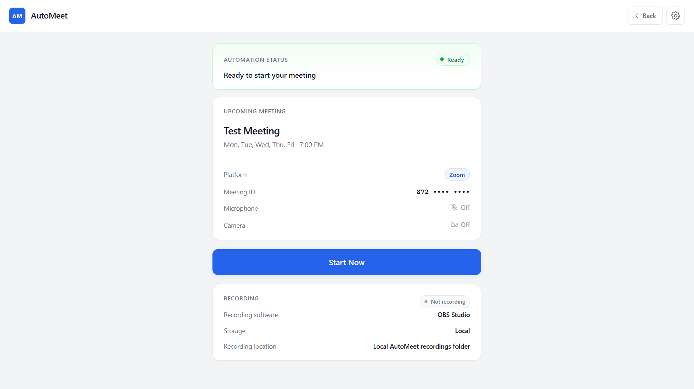
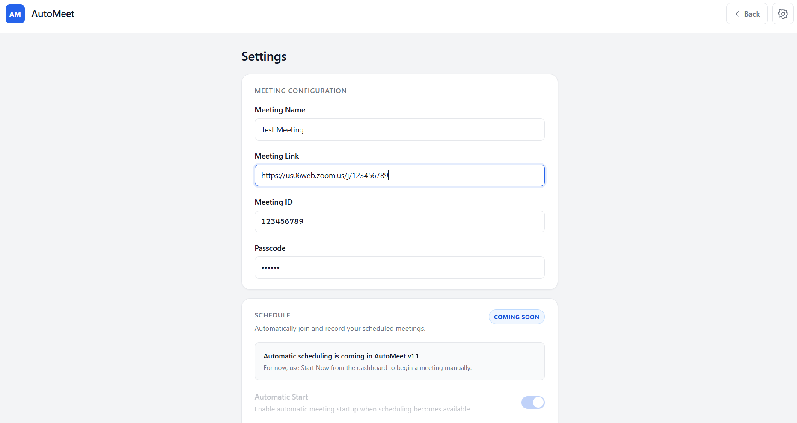
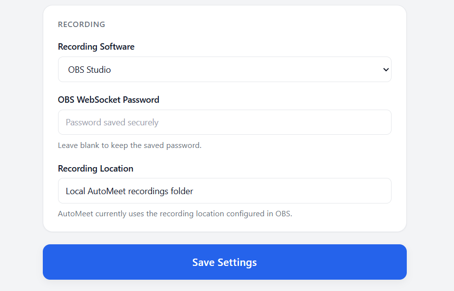

# AutoMeet

> A privacy-first Windows desktop application that automates joining a Zoom meeting and controlling local OBS recording.

AutoMeet is a local Electron desktop application designed to simplify a recurring meeting/class workflow.

Instead of manually opening Zoom, joining a meeting, starting OBS recording, monitoring the meeting, and stopping the recording afterward, AutoMeet coordinates these steps from a single interface.

> **Current status:** AutoMeet v1 still requires the user to click **Start Now**. Once triggered, AutoMeet handles the Zoom and OBS workflow automatically. Fully scheduled/automatic startup is planned for v1.1.

The application is designed around one principle:

**Keep the automation local. Keep the recordings local. Keep the user's credentials private.**

---

## 💡Why I made AutoMeet?

AutoMeet was built around a real problem I faced with my regular online classes. My classes start in the evening, but sometimes I would reach home late. In those situations, I had to ask a family member to turn on the computer, join the class for me. When I came back home, I would directly join the ongoing lecture and later go through the recording to catch up on anything I had missed. This also helps me maintain attendance, and also get the session recordings.

The problem was that this workflow depended on someone else being available every time.

I wanted to see if I could make the computer handle this process on its own. That idea eventually became AutoMeet.

AutoMeet is my attempt to automate that workflow locally.

---

## 📸 Screenshots

### Dashboard



### Settings

## 



---

## ✨ Features

### AutoMeet v1

- Launch Zoom and open a configured meeting
- Detect when the actual Zoom meeting becomes active
- Automatically launch OBS Studio when required
- Connect to OBS through OBS WebSocket
- Start and verify local recording
- Monitor the meeting until it ends
- Automatically stop recording when the meeting ends
- Real-time automation and recording status
- Friendly error handling
- Secure local storage of the OBS WebSocket password
- No AutoMeet backend, cloud storage, telemetry, or analytics


### Coming in future releases

- Scheduled automatic meeting startup
- Recurring meetings
- Multiple scheduled meetings
- Windows startup support
- Notifications
- Recording folder access
- Additional automation improvements

---

## 🧩 How It Works

AutoMeet acts as a local automation layer between Zoom and OBS.

```text
              AutoMeet
             /        \
            ↓          ↓
         Zoom          OBS
      Meeting      Local Recording
```

AutoMeet uses Windows process detection to determine when the Zoom meeting is active and OBS WebSocket to control recording.

No AutoMeet server is required.

---

## 🔐 Privacy & Security

AutoMeet is designed to keep the automation local.

- No AutoMeet cloud backend
- No telemetry
- No analytics
- No cloud recording storage
- Recordings remain under OBS's local configuration
- OBS WebSocket credentials are encrypted using Electron's `safeStorage`
- Renderer/main-process separation is enforced
- `contextIsolation` is enabled
- `nodeIntegration` is disabled
- Electron sandboxing is enabled

For the complete security and architecture details, see the
**[AutoMeet Documentation](docs/AUTOMEET_DOCUMENTATION.md)**.

---

# 🚀 Installation

## 👤 For Normal Users

Once a Windows release is available:

1. Download the latest AutoMeet installer from the **Releases** page.
2. Run the installer.
3. Launch AutoMeet.
4. Install and configure Zoom Desktop Client if you haven't already.
5. Install and configure OBS Studio.
6. Enter your Zoom meeting information in AutoMeet.
7. Configure the OBS WebSocket connection.
8. Click **Start Now** when you want AutoMeet to handle a meeting.

> **Note:** The packaged Windows installer will be provided with the project releases.

---

## 👨‍💻 For Developers

### Requirements

- Windows 10/11
- Node.js
- npm
- Zoom Desktop Client
- OBS Studio
- Git

### Clone the repository

```bash
git clone <https://github.com/iabhijithks/AutoMeet>
cd AutoMeet
```

### Install dependencies

```bash
npm install
```

### Start AutoMeet

```bash
npm start
```

---

# ⚙️ Initial Setup

AutoMeet v1 requires a one-time OBS configuration.

### Zoom

Configure your meeting information through:

**AutoMeet → Settings**

You can provide:

- Meeting name
- Zoom meeting link
- Meeting ID
- Meeting passcode

### OBS

Create an OBS scene for recording and configure the required recording source.

Then enable:

**OBS → Tools → WebSocket Server Settings**

Use:

```text
Port: 4455
Authentication: Enabled
```

Set a WebSocket password and enter the same password in AutoMeet Settings.

AutoMeet encrypts the password using Electron's safeStorage before storing it locally.

For complete setup instructions, troubleshooting, architecture, and implementation details, see:

**[📖 AutoMeet Documentation](docs/AUTOMEET_DOCUMENTATION.md)**

---

# ▶️ How to Use

1. Open AutoMeet.
2. Verify your meeting information.
3. Click **Start Now**.
4. AutoMeet opens the configured Zoom meeting.
5. AutoMeet waits until the actual meeting is detected.
6. OBS is launched and connected if necessary.
7. Recording starts automatically.
8. AutoMeet monitors the meeting.
9. When the meeting ends, recording is stopped automatically.

### Current limitation

The user still needs to click **Start Now**.

Automatic scheduled startup is planned for **v1.1**.

---

# ⚠️ Limitations

AutoMeet v1 currently has some limitations:

- Windows only
- Zoom Desktop Client is required
- OBS Studio must be installed
- OBS requires manual initial configuration
- Automatic scheduling is not implemented yet
- Zoom meeting detection relies on local Windows process behavior rather than an official Zoom meeting-state API
- Changes to Zoom or OBS could require future compatibility updates

---

# 💬 Feedback & Bug Reports

Found a bug, have a suggestion, or want to share feedback?

**[Submit Feedback / Report a Bug](https://forms.gle/iPgPFX85LVGwr8Lj8)**

When reporting a bug, please include:

- What you were trying to do
- What you expected to happen
- What actually happened
- Any error message displayed by AutoMeet

**Please do not submit passwords, meeting credentials, private recordings, or other sensitive information through the form.**

---

# 📖 Documentation

The README intentionally contains only the information needed to understand and use AutoMeet.

For the complete technical documentation, including:

- Architecture
- Project structure
- Security design
- Electron IPC
- Zoom detection
- OBS integration
- Credential storage
- Design decisions
- Error handling
- Development details
- Troubleshooting
- Roadmap

see:

**[📖 AutoMeet Documentation](docs/AUTOMEET_DOCUMENTATION.md)**

---

# 🔐 Responsible Use

AutoMeet is intended for legitimate personal and educational automation.

AutoMeet does not provide a platform for distributing class recordings. Recordings remain under the user's local OBS configuration. Users are responsible for complying with applicable institutional policies and obtaining any required permission or consent for recording.

Users are responsible for:

- Following Zoom's terms and policies
- Following their institution's or organization's policies
- Obtaining required consent before recording meetings
- Handling recordings appropriately
- Protecting meeting credentials

Recording laws and organizational policies may vary by location.

AutoMeet is not intended to facilitate unauthorized distribution of meeting recordings. Users should keep recordings private unless they have permission to share them.
---

# 📜 License

License information will be provided in the repository's `LICENSE` file.

---

# 👨‍💻 Author

**Abhijith K S**

AutoMeet is a personal engineering project built to solve a real problem while exploring desktop application development, system automation, Electron security, process management, and OBS integration.

---

⭐ If you find AutoMeet interesting, consider starring the repository and providing feedback.